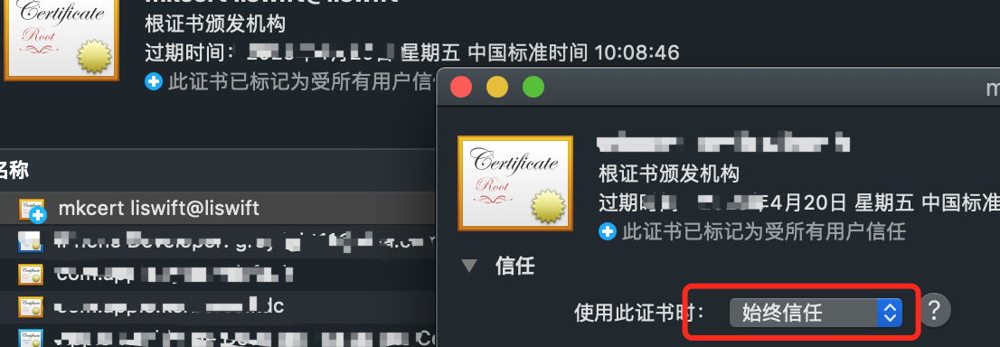
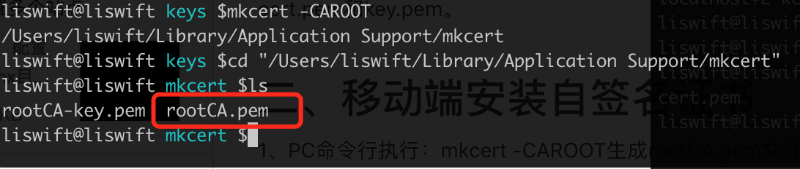

# vlan-https
使用自签名证书实现内网https访问，解决chrome等浏览器的安全告警，支持移动设备访问内网自签名https。

# 工具
[mkcert](https://github.com/FiloSottile/mkcert)：生成自签名证书；

[anyqhere](https://github.com/JacksonTian/anywhere)：在任意文件夹启动http/https服务。

# 步骤
## 一、PC端安装证书和anywhere
1、`brew install mkcert`安装mkcert。

2、安装证书：
```
// 安装证书，过程中会要求输入登录密码
$ mkcert -install
Created a new local CA at "/Users/filippo/Library/Application Support/mkcert" 💥
The local CA is now installed in the system trust store! ⚡️
The local CA is now installed in the Firefox trust store (requires browser restart)! 🦊
```

3、为指定的域名/ip生成证书。如果要使用内网ip调试https，必须加上内网ip（假设内网ip是172.22.xx.xx）：
```
$ mkcert localhost 127.0.0.1 ::1 172.22.xx.xx
Using the local CA at "/Users/filippo/Library/Application Support/mkcert" ✨

Created a new certificate valid for the following names 
 - "localhost"
 - "127.0.0.1"
 - "::1"
 - "172.22.xx.xx"

The certificate is at "./example.com+5.pem" and the key at "./example.com+5-key.pem" ✅
```


4、打开"/Users/filippo/Library/Application Support/mkcert"目录（mkcert -install后打印的路径），双击rootCA.pem文件，添加证书到钥匙串（windows是相应的证书管理界面）,并始终信任这个证书。（过程中需要输入登录密码）:


5、命令行中，npm install -g anywhere安装anywhere。（https://github.com/JacksonTian/anywhere）

6、进入anywhere的安装目录的证书目录里：
`cd $(npm root -g)/anywhere/keys`，新建一个old-keys目录存放anywhere自带的cert.pem和key.pem，
然后将上面拿到的example.com+5.pem和example.com+5-key.pem（名字会根据步骤三命令中的第一个参数来定）复制到keys目录下，名字分别改成cert.pem和key.pem。

7、至此，PC上已经可以使用https访问内网ip了。

## 二、移动端https访问内网ip

1、移动端安装自签名证书。PC命令行执行：`mkcert -CAROOT`生成rootCA.pem文件，把这个文件copy到启动anywhere的项目目录（就是你运行anywhere启动服务的那个目录）。这个copy操作的目的是在移动端可以通过访问地址下的rootCA.pem直接就能下载安装这个证书，而不需要其他麻烦方法把证书从PC传到移动端。


2、保证anywhere服务已启用，然后移动端设备浏览器访问服务地址下的rootCA.pem，比如http://172.22.xxx.xxx:8000/rootCA.pem，安装证书。证书的安装流程和安装fiddler证书一样了，ios要注意信任证书。

3、安装完成后，就可以愉快的通过https访问anywhere启用的https服务了，chrome等浏览器也不会报证书不信任了～
